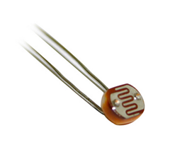

## Arduino入門教學(8) – 使用光敏電阻控制 LED 的開關 (作者：Cooper Maa)

### 實驗目的

利用光敏電阻做一個 LED 的自動開關，在光線不足時，自動打開 LED 燈，反之，光線充足時便關掉 LED 燈。



### 材料

* 麵包板 x 1
* Arduino 主板 x 1
* 光敏電阻(photocell) x 1
* 220 ohm 電阻 x 1
* 10k ohm 電阻 x 1
* 單心線 x N
* 接線

光敏電阻一支腳接到 5V，另一支腳串接一顆 10k 電阻接到 analog pin 2
LED 接到 pin9 和 GND，長腳(陽極)串接一顆 220 ohm 電阻到 pin9，短腳(陰極)直接接到 GND


 
### 電路圖


### 程式碼

實驗一(Photocell.pde)：讀取光敏電阻並輸出到 Serial Port，先確定光敏電阻可以運作

```CPP
// LAB8 - 讀取光敏電阻 (v1)

int photocellPin = 2; // 光敏電阻 (photocell) 接在 anallog pin 2
int photocellVal = 0; // photocell variable

void setup() {
  Serial.begin(9600);
}

void loop() {
  // 讀取光敏電阻並輸出到 Serial Port 
  photocellVal = analogRead(photocellPin);
  Serial.println(photocellVal);  
  delay(100);       
}
```

假如一切順利的話，如下圖，打開 Serial Monitor 會看到 COM Port 不斷收到一串數據，那便是光敏電阻的讀值，試著用手去遮住光線，應該會看到電阻值跟著變小，代表光敏電阻的運作是正常的。


實驗二(Photocellv2.pde)：加上 LED 的開關控制，在光線不足時，自動打開 LED 燈，反之，光線充足時便關掉 LED 燈

```CPP
// LAB8 - 讀取光敏電阻 (v2)

int photocellPin = 2; // 光敏電阻 (photocell) 接在 anallog pin 2
int photocellVal = 0; // photocell variable
int minLight = 200;   // 最小光線門檻值
int ledPin = 9;
int ledState = 0; 

void setup() {
  pinMode(ledPin, OUTPUT); 
  Serial.begin(9600);
}

void loop() {
  // 讀取光敏電阻並輸出到 Serial Port 
  photocellVal = analogRead(photocellPin);
  Serial.println(photocellVal);   
  
  // 光線不足時打開 LED
  if (photocellVal < minLight && ledState == 0) {
    digitalWrite(ledPin, HIGH); // turn on LED
    ledState = 1;
  }
  
  // 光線充足時關掉 LED
  if (photocellVal > minLight && ledState == 1) {
    digitalWrite(ledPin, LOW); // turn off LED
    ledState = 0;
  }  
  
  delay(100);       
}
```

### 範例照片／影片

* Arduino 筆記 -- Lab8 使用光敏電阻控制 LED 的開關
    * <http://youtu.be/3qLCi0Ughk0>

### 動動腦

現在的筆記型電腦，通常都會自動調整螢幕背光亮度，在光線比較充足時，跟著調高背光亮度，在環境比較暗時，就降低背光的亮度，這樣使用者在操作筆電時就不會有不適的感覺，在暗的地方螢幕就不會太刺眼，在亮的地方也不怕不看到螢幕上的東西。試解釋筆電自動調整背光的原理。

【本文作者為馬萬圳，原文網址為： <http://coopermaa2nd.blogspot.tw/2010/12/arduino-lab8-led.html> ，由陳鍾誠編輯後納入本雜誌】
