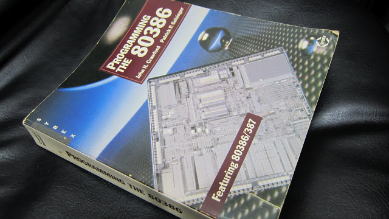

## x86 machine code 初探 (0) - base register address mode (作者：Descent Sung)

我從來沒想過我會學習 machine code, 而且 x86 machine code 實在太複雜, 花了很多心力才有點進展。本來直接拿起 intel 那令人害怕的手冊硬 K, 果然不行, 有看沒有懂, 再看 ref 3, 還是看不懂。而在閱讀了 ref 1, 2 後, 我如獲至寶, 看懂之後再翻閱 ref 3, 終於有了進展。當能看懂時, 心中的興奮之情, 恐怕只有和我一樣在 machine code 裡頭掙扎的同好才能理解。

不過 x86 machine code 實在太複雜, 我並沒能搞懂所有格式。

為什麼要研究 machine code 呢？因為要改寫執行檔的位址, 做類似 dynamic loader/linker 的事情, 會看這篇文章的朋友, 難道你對於 dynamic loader/linker 的原理沒有興趣嗎？不會想個方法來實驗這件事情嗎？Binary Hacks--駭客秘傳技巧一百招 #72 就在談這個。 

讓我們從 intel memory address 開始。intel 著名的 segmentation memory address, 將記憶體位址分為 segment part, offset part, 本文章重點擺在 offset part。而台灣翻譯的基底/索引定址法 (中國的翻譯則是 ...) 則為 base/index。

offset part 有三個欄位:

1. base register
2. index register multiplied 1, 2, 4, 8 (1, 2, 4, 8 被稱為 scale factor)
3. displacement

base + index * scale + displacement = offset part

ex:

at&t syntax add 0x12345678(%eax, %esi, 4), %esi
intel syntax add esi, [eax+esi*4+0x12345678]

本篇文章大量參考 Programming THE 80386 (instruction encoding - p59):



這是 1987 年的書 (我寫這篇文章的時間是 20130612), 在電腦界這麼快速更新的時代, 照理說應該是過期的書籍, 不過由於相容性的緣故, 裡頭提到的東西到現在都還是可以用的, 而且簡單不少 (也沒有  64 bit mode), intel 手冊已經變得又厚又硬難以閱讀, 而這本書講的比較好理解。有些術語和最新的 intel 手冊有些不同, 不過不影響理解。

之前在閱讀 [IBM 80X86 組合語言實務](http://descent-incoming.blogspot.tw/2010/11/dropbox-for-linux.html) 被其複雜的定址模式搞得我好亂, 現在一次把它搞懂。這些複雜的 address mode 是針對 offset part 而來, 大概就是 base register 和 index register mode 這兩種比較複雜。而 16 bit 和 32 bit 又有點不同, 64 bit 沒研究, 就不提了。

16 bit 和 32 bit 可用來當 base/index register 的暫存器有些不同。為什麼呢？讀懂 machine code 就可以回答這問題。

x86 machine code 順序, 後面的數字是 byte 數目:

1. prefix 0-4
2. opcode 1-2
3. modrm 0-2
4. displacement 0-4
5. immediate 0-4

這是這本書的解釋, 和目前的 intel 手冊有些不同, 目前的 intel 手冊把 modrm 分為 modrm + sib, 不過沒關係, 原則都是一樣的。我建議先看過 ref 1, ref 2 再看這篇, 如果真的沒時間至少也要看過 ref 2, 因為他們提到的東西, 我不會特別說明, 請花點時間看, 若你真想理解這玩意, 應該有覺悟要佔去你不少休閒時間。

檔案：address_mode.S

```
1 # practice x86 machine code
2 .code16
3 #.code32
4 .text
5 .global begin
6 begin:
7   add (%bx), %ax
```

看看 L7 的組語, 這使用了 base register address mode。

```
objdump -d -m i8086 address_mode.elf

1 descent@w-linux:x86_machine_code$ objdump -d -m i8086 address_mode.elf 
2 
3 address_mode.elf:     file format elf32-i386
4 
5 
6 Disassembly of section .text:
7 
8 00000100 <_text>:
9  100:   03 07                   add    (%bx),%ax
```

由於 intel cpu 有 16/32/64 bit mode, 所以我們得選擇要讓組譯器用那種 bit mode 來翻譯出 machine code, 這個例子是  16 bit (ref address_mode.S L2, L3)。

03 07 是 machine code, 對應到 opcode modrm 這兩欄, 沒有 prefix, displacement, immediate 這些部份。

來看看 add 的 opcode:

<http://css.csail.mit.edu/6.858/2011/readings/i386/ADD.htm>

有好幾個, 看以下這個:

```
03 /r     ADD r16,r/m16        2/6      Add r/m word to word register
clock 那欄我看不懂, 有請大大解惑。
所以 03 是 opcode, 03 搞定, 那 07 是什麼?

07 是 modrm 這欄, 再細分解為 2:3:3 欄位,
0000 0111 -> 00 000 111
mod: 00
reg: 000
r/m: 111
```

把 mod, r/m 拿來查表。

mod = 00 時的對照表 (16 bit)

Effective Address   r/m
------------------  --------------
[BX+SI]             000
[BX+DI]             001
[BP+SI]             010
[BP+DI]             011
[SI]                100
[DI]                101
disp16              110
[BX]                111

得到 [BX], 這是 base register address mode

reg: 000 代表 ax register

register table

REG    Register
-----  ---------------
000    EAX/AX
001    ECX/CX
010    EDX/DX
011    EBX/BX
100    ESP/SP
101    EBP/BP
110    ESI/SI
111    EDI/DI

得到 add ax, [bx] (intel syntax), 恭喜, 終於看懂 machine code 了。但是要從 add ax, [bx] 得到 03 07 就比較難了。

這在 intel 術語稱為: one-byte address mode encoding。

這篇好像有點長了, 不過打鐵趁熱, 來看看 prefix 的例子。

檔案：address_mode1.S

```
1 # practice x86 machine code
2 .code16
3 #.code32
4 .text
5 .global begin
6 begin:
7   add (%bx), %eax
```

和 address_mode.S 的差別僅在 %eax, %ax 改成 %eax。我一直被 16 bit 程式碼可以使用 32 bit register 所疑惑, 這樣的程式碼倒底是 16 bit 還是 32 bit? 當然是 16 bit, 那你和我覺得疑惑可以使用 32 bit register 嗎？讓我們透過 prefix 解除這疑惑。

```
objdump -d -m i8086 address_mode.elf

1 descent@w-linux:x86_machine_code$ objdump -d -m i8086 address_mode.elf 
2 
3 address_mode.elf:     file format elf32-i386
4 
5 
6 Disassembly of section .text:
7 
8 00000100 <_text>:
9  100:   66 03 07                   add    (%bx),%eax
```

machine code 則多了一個 66, 這就是 prefix, 用來切換 operand size, 這裡的例子是從 16 bit 切換成 32 bit, 本程式執行在 16 bit 下, 而 %eax 是 32 bit operand, 所以要加上 prefix 0x66, 就這麼簡單。

### 想想看:

什麼是 32 bit 執行環境?
A: ...

若在 32 bit 執行環境執行這個 machine code 又是什麼意思？

A:

```
.code32
.text
.global begin
begin:
  add (%edi), %ax
```

很有意思吧, x86 就是這麼討厭又讓人喜愛。

好用的組譯器: <http://radare.org/y/?p=examples&f=rasm> ，玩 machine code 的朋友一定要試試。

### 參考文獻
1. x86/x64 指令编码内幕（适用于 AMD/Intel）:  <http://www.mouseos.com/x64/index.html> 
2. 学习 OpCode:  <http://www.luocong.com/learningopcode.htm> 
3. Programming THE 80386
4. <http://ref.x86asm.net/coder32.html>

【本文原文網址為： <http://descent-incoming.blogspot.tw/2013/06/x86-machine-code-0-base-register.html> ，由陳鍾誠編輯後納入本雜誌】
