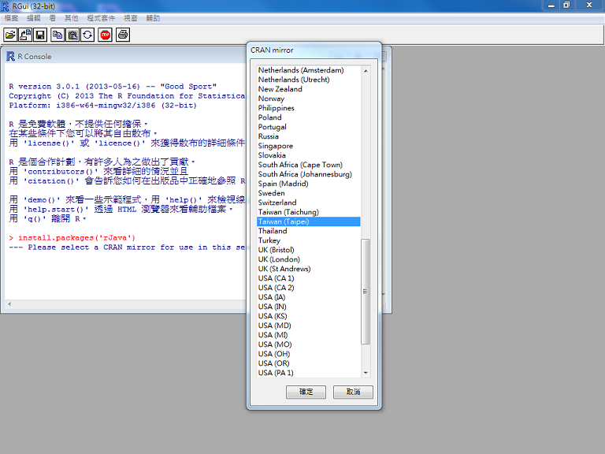

## 如何讓 R 與 Java 溝通 - rJava (作者：Taiwan R User Group)

R 是目前最熱門的 Open Source 統計語言。除了傳統的統計檢定之外，R也有套件支援許多 Machine Learning 和 Data Mining 的技術。因此使用者可以很方便的在R上實作各種分析方法。

[rJava](http://www.rforge.net/rJava/ "rJava官網") 在 [Top 100 R packages for 2013](http://www.r-statistics.com/2013/06/top-100-r-packages-for-2013-jan-may/ "Top 100 R packages for 2013 (Jan-May)!") 名單中排名第17名，是讓 R 呼叫 Java 撰寫的物件(Class)、實例(Instance)和方法(Method)的套件。這個套件降低R調用Java既有的資源的難度，例如[Google APIs](https://developers.google.com/apis-explorer/ "Google APIs")、[Hadoop](http://hadoop.apache.org/)等等。

### 安裝步驟

輸入`install.packages('rJava')`，選取CRAN位置之後，便完成安裝。



### 初始化`rJava`

每次在使用`rJava`之前，都要先啟動JVM：


```r
library(rJava)
.jinit()
```


### Hello World

我們先依照[rJava官網文件](http://www.rforge.net/rJava/ "rJava官網")的介紹，來Demo一個Hello World吧！首先，使用[`.jnew`](http://www.rforge.net/doc/packages/rJava/jnew.html "jnew Doc")來產生一個[java.lang.String](http://docs.oracle.com/javase/6/docs/api/java/lang/String.html "String JavaDoc")的instance "s"，


```r
s <- .jnew("java/lang/String", "Hello World!")
s
```

```
## [1] "Java-Object{Hello World!}"
```


從輸入s之後就可看出，s屬於Java-Object，且其內容為`Hello World!`。

### 建立Java物件的Reference

透過 `J`，使用者可以取出Java物件的Reference，進而存入一個R的變數：


```r
pi <- J("java.lang.Math")
pi
```

```
## [1] "Java-Class-Name: java.lang.Math"
```


### 建立Java實例

透過 `.jnew`，使用者可以建立某個Java物件的實例：


```r
s <- .jnew("java/lang/String", "Hello World!")
s
```

```
## [1] "Java-Object{Hello World!}"
```


### 取得Java物件的屬性值

取得Java物件的屬性有兩種方法：

- [`.jfield`](http://www.rforge.net/doc/packages/rJava/jfield.html "jfield Doc")
- `$`+Field名


```r
.jfield("java.lang.Math", , "PI")
```

```
## [1] 3.142
```

```r
pi$PI
```

```
## [1] 3.142
```


### 使用物件的方法

呼叫Java物件的方法可以用

- [`.jcall`](http://www.rforge.net/doc/packages/rJava/jcall.html "jcall Doc")
    `.jcall`的第一個參數是java物件變數，第二個是Return Type(定義請見下圖，[出處](http://cran.r-project.org/web/packages/helloJavaWorld/vignettes/helloJavaWorld.pdf "Hello Java World! A Tutorial for Interfacing to
Java Archives inside R Packages."))，第三是Java物件的方法名稱。
- `$`+Method名


```r
.jcall(s, "I", "length")
```

```
## [1] 12
```

```r
s$length()
```

```
## [1] 12
```


若是要查詢物件的Method，則可以利用：

- `.jmethods`
- `names(obj)`
- `obj$`+`TAB`鍵(自動完成)


```r
.jmethods(pi)
```

```
##  [1] "public static int java.lang.Math.abs(int)"                                                 
##  [2] "public static double java.lang.Math.abs(double)"                                           
##  [3] "public static long java.lang.Math.abs(long)"                                               
##  [4] "public static float java.lang.Math.abs(float)"                                             
##  [5] "public static double java.lang.Math.sin(double)"                                           
##  [6] "public static double java.lang.Math.cos(double)"                                           
##  [7] "public static double java.lang.Math.tan(double)"                                           
##  [8] "public static double java.lang.Math.atan2(double,double)"                                  
##  [9] "public static double java.lang.Math.sqrt(double)"                                          
## [10] "public static double java.lang.Math.log(double)"                                           
## [11] "public static double java.lang.Math.log10(double)"                                         
## [12] "public static double java.lang.Math.pow(double,double)"                                    
## [13] "public static double java.lang.Math.exp(double)"                                           
## [14] "public static long java.lang.Math.min(long,long)"                                          
## [15] "public static double java.lang.Math.min(double,double)"                                    
## [16] "public static int java.lang.Math.min(int,int)"                                             
## [17] "public static float java.lang.Math.min(float,float)"                                       
## [18] "public static float java.lang.Math.max(float,float)"                                       
## [19] "public static double java.lang.Math.max(double,double)"                                    
## [20] "public static long java.lang.Math.max(long,long)"                                          
## [21] "public static int java.lang.Math.max(int,int)"                                             
## [22] "public static double java.lang.Math.scalb(double,int)"                                     
## [23] "public static float java.lang.Math.scalb(float,int)"                                       
## [24] "public static int java.lang.Math.getExponent(double)"                                      
## [25] "public static int java.lang.Math.getExponent(float)"                                       
## [26] "public static float java.lang.Math.signum(float)"                                          
## [27] "public static double java.lang.Math.signum(double)"                                        
## [28] "public static double java.lang.Math.asin(double)"                                          
## [29] "public static double java.lang.Math.acos(double)"                                          
## [30] "public static double java.lang.Math.atan(double)"                                          
## [31] "public static double java.lang.Math.toRadians(double)"                                     
## [32] "public static double java.lang.Math.toDegrees(double)"                                     
## [33] "public static double java.lang.Math.cbrt(double)"                                          
## [34] "public static double java.lang.Math.IEEEremainder(double,double)"                          
## [35] "public static double java.lang.Math.ceil(double)"                                          
## [36] "public static double java.lang.Math.floor(double)"                                         
## [37] "public static double java.lang.Math.rint(double)"                                          
## [38] "public static long java.lang.Math.round(double)"                                           
## [39] "public static int java.lang.Math.round(float)"                                             
## [40] "public static double java.lang.Math.random()"                                              
## [41] "public static float java.lang.Math.ulp(float)"                                             
## [42] "public static double java.lang.Math.ulp(double)"                                           
## [43] "public static double java.lang.Math.sinh(double)"                                          
## [44] "public static double java.lang.Math.cosh(double)"                                          
## [45] "public static double java.lang.Math.tanh(double)"                                          
## [46] "public static double java.lang.Math.hypot(double,double)"                                  
## [47] "public static double java.lang.Math.expm1(double)"                                         
## [48] "public static double java.lang.Math.log1p(double)"                                         
## [49] "public static double java.lang.Math.copySign(double,double)"                               
## [50] "public static float java.lang.Math.copySign(float,float)"                                  
## [51] "public static double java.lang.Math.nextAfter(double,double)"                              
## [52] "public static float java.lang.Math.nextAfter(float,double)"                                
## [53] "public static double java.lang.Math.nextUp(double)"                                        
## [54] "public static float java.lang.Math.nextUp(float)"                                          
## [55] "public final native void java.lang.Object.wait(long) throws java.lang.InterruptedException"
## [56] "public final void java.lang.Object.wait() throws java.lang.InterruptedException"           
## [57] "public final void java.lang.Object.wait(long,int) throws java.lang.InterruptedException"   
## [58] "public native int java.lang.Object.hashCode()"                                             
## [59] "public final native java.lang.Class java.lang.Object.getClass()"                           
## [60] "public boolean java.lang.Object.equals(java.lang.Object)"                                  
## [61] "public java.lang.String java.lang.Object.toString()"                                       
## [62] "public final native void java.lang.Object.notify()"                                        
## [63] "public final native void java.lang.Object.notifyAll()"
```

```r
names(pi)
```

```
##  [1] "class"          "E"              "PI"             "abs("          
##  [5] "abs("           "abs("           "abs("           "sin("          
##  [9] "cos("           "tan("           "atan2("         "sqrt("         
## [13] "log("           "log10("         "pow("           "exp("          
## [17] "min("           "min("           "min("           "min("          
## [21] "max("           "max("           "max("           "max("          
## [25] "scalb("         "scalb("         "getExponent("   "getExponent("  
## [29] "signum("        "signum("        "asin("          "acos("         
## [33] "atan("          "toRadians("     "toDegrees("     "cbrt("         
## [37] "IEEEremainder(" "ceil("          "floor("         "rint("         
## [41] "round("         "round("         "random()"       "ulp("          
## [45] "ulp("           "sinh("          "cosh("          "tanh("         
## [49] "hypot("         "expm1("         "log1p("         "copySign("     
## [53] "copySign("      "nextAfter("     "nextAfter("     "nextUp("       
## [57] "nextUp("
```

```r
## pi$+TAB
```


### 使用Java Library Jar

如果使用者要呼叫非JDK內建的物件(如：[SWT](http://www.eclipse.org/swt/ "SWT: The Standard Widget Toolkit"))，則必須先匯入定義該物件的jar檔。具體操作如下：

- 用`.jaddClassPath`設定R 搜尋`.jar`的路徑。


```r
.jaddClassPath(dir("C:/rJava", full.names = TRUE))
```


完成後，可用`.jclassPath()`來確認。


```r
.jclassPath()
```

```
## [1] "/home/wush/R/x86_64-pc-linux-gnu-library/3.0/rJava/java"
```


接下來，新增一個SWT的Display物件。


```r
display <- .jnew("org/eclipse/swt/widgets/Display")
```


再新增一個Shell物件來裝Display物件。


```r
shell <- .jnew("org/eclipse/swt/widgets/Shell", display)
shell$open()
```


便可產生出SWT視窗。


### Java 程式碼包裝成 R Package

接下來依照那，[Hello Java World! A Tutorial for Interfacing to Java Archives inside R Packages.](http://cran.r-project.org/web/packages/helloJavaWorld/vignettes/helloJavaWorld.pdf "Hello Java World! A Tutorial for Interfacing to
Java Archives inside R Packages.")，撰寫一個使用rJava的R Package。這樣所有之前繁瑣的設定動作，全部簡化成`library(xxx)`，而且需要的`jar`檔也可以隨著套件散佈，並安裝到適當的位置。

### 利用 Google SMTP 傳送 Email

首先，撰寫好Java傳送Email的程式打包成jar檔，放置套件根目錄(範例中是`C:\helloJavaWorld`)內的`inst\java`目錄下，並於套件根目錄的R目錄下，新增email.R：


```r
email <- function(s, o) {
    email <- .jnew("addEvent")
    email$GamilSender(s, o)
}
```


接下來要設定套件，讓email函數可以供其他使用者呼叫：

- 到套件根目錄下的`DESCRIPTION`檔案之內，在`Collate:`下加上`'email.R'`。
- 修改套件根目錄下的`NAMESPACE`檔案，在檔案中加上`export("email")`。

完成後，透過


```r
install.packages("C:/helloJavaWorld", repos = NULL, type = "source", INSTALL_opts = "--no-multiarch")
```


安裝剛剛建立的套件後，就可以用`email`函數來寄信了！


### SWT GUI While Loop 問題

以下是另一個使用SWT的範例，[rJavaTest.java](https://github.com/philipz/R_Capital_API "範例 GitHub 位置")。

因R 是單緒程(Single Thread)，所以直接使用SWT語法的while loop，會發生R一直停在那Java程式(blocking)。為了避免blocking，我們將SWT的使用方法改寫成使用Java Thread物件，並利用[Design Pattern](http://en.wikipedia.org/wiki/Design_pattern "Wikipedia Design Pattern") – [Singleton](http://en.wikipedia.org/wiki/Singleton_pattern "Wikipedia Singleton")來取值，這是用rJava呼叫Java程式時可能會遇到的狀況。


```r
while (!shell.isDisposed()) {
    if (!display.readAndDispatch()) 
        display.sleep()
}
display.dispose()
```


***

### 作者

#### Philipz ([philipzheng@gmail.com](mailto:philipzheng@gmail.com))

- [Taiwan R User Group](https://www.facebook.com/Tw.R.User) Officer
- 研究領域：Image Processing, Software Engineering, Algorithmic Trading
- 開放原始碼專案：[TradingBot 程式交易機器人](https://github.com/philipz/FuturesBot)
- Blog: [Philipz學習日誌](http://server.everfine.com.tw/blog/)

#### Wush Wu ([wush978@gmail.com](mailto:wush978@gmail.com))

- [Taiwan R User Group](https://www.facebook.com/Tw.R.User) Organizer
- R 相關著作：
    - [RMessenger](http://cran.r-project.org/web/packages/RMessenger/index.html)的作者
    - [RSUS](https://bitbucket.org/wush_iis/rsus)，這是[On Shortest Unique Substring Query](http://www.cs.sfu.ca/~jpei/publications/MISQ_ICDE12.pdf)的實作
- 研究領域：Large Scale Learning，[Text Mining](http://www.cs.sfu.ca/~jpei/publications/MISQ_ICDE12.pdf)和[Uncertain Time Series](http://www.cs.sfu.ca/~jpei/publications/Shortest%20Unique%20Substring%20Queries%20ICDE13.pdf)

