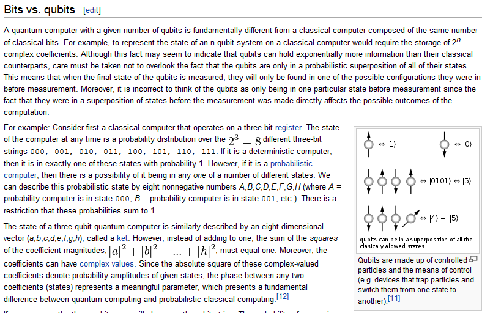

## 新科技討論 – 南加州大學：Google量子計算機是真的

2013 年 7 月 2 日，我看到以下的新聞，但是感到很疑惑，因為在我的印象中，
量子電腦應該還沒辦法產品化阿！該怎麼看這樣的新聞呢？

* 南加州大學：Google量子計算機是真的
	* <http://www.hksilicon.com/kb/articles/180950/> 

所以我就分享了這篇文章，發了下列訊息，看看有沒有高人可以提供訊息，

* <https://www.facebook.com/groups/programmerMagazine/permalink/668603293156390/>

以下是網友們的回應：
	
* Y○○： 為什麼原創公司沒有說明呢?
* I○○： 天網〜
* 陳鍾誠 雖然我知道退火，也知道量子電腦，但是兩者之間的關係我還真的搞不清楚啊！
* Y○○： 我樸素地理解, 模擬退火是用亂數來模擬自然界亂的狀態,並且在狀態上藉著某些參數的調整來模擬降低溫度而讓狀態自然地達到穩定點而了解穩點解, 然而因為狀態很多, 所以就需要很大的計算量. 量子上因為一個狀態是多重狀態的線性疊加,因此以一個狀態去作操作可能可以達到數倍 (或更多 ?) 狀態計算的結果, 因此有可能達到近似於 "直覺看到解答" 的最終效果, 而快速收斂到穩定解.我大概是這樣理解的.
* D○○： 不好意思，我一直不太懂多重狀態如何增加運算能量？可以請先進幫助解釋嗎？感謝！
* U○○： 個人比較好奇為什麼需要第三方的機構（南加州大學）用推測的方式「嘗試證明」是量子電腦, 官方公司卻不提供詳細細節？（雖然原因大概能猜出來．．．唉）
* 邱○○： 量子電腦 還有一段長的路要走 例如 外部量子訊息如何讀取 (磁碟片) 如何進行運算 (CPU) 量子訊息如何Output (外部儲存裝置) 而且這個系統必須要可以不斷的擴充 而且還有計算的結果必須要有高的可靠度 (因為溫度會改變 量子的狀態) 不過我對於他計算質數的能力 非常有興趣 可以是傳統電腦的一萬倍以上 這表示 以後要破解加密的密碼 不用花到一秒鐘
* 梁○○： 這個小故事或可以說明量子電腦運算模型跟傳統之不同。愛迪生～沒讀太多書，所以找來一個數學很強的科學家來幫他設計燈泡，有一次～愛迪生丟一個燈泡給科學家：請告訴我它的容積。結果這個科學家～用了很複雜的微積分計算半天～還沒結果，愛迪生覺得很奇怪，為什麼搞這麼久～還沒答案？過去一看～這位老兄還低頭忙著計算。愛迪生說～這有什麼好算的？裝水進去～再倒出來量～不就有答案了！？傳統電腦模型就像計算微積分，按照步驟運算。目前期望可以帶來驚奇的量子運算～則是用測量得到答案！
* S○○： 「量子退火」應該只是類比的名詞跟傳統資訊的操作不太一樣 ～ 不過說來好玩的是這原本也是模擬物理現象
* T○○： 應該沒有意義, 同樣的計算, 換另一個方向去想, 一般二進制計算的電腦也辦得到, 例如以一個DWORD 代表 1個變數的 2^32個狀態, 用現有的計算方式足夠了, 不論是模糊鑼輯, 還是類神經元運算, 至於運算能力, 用分散式運算, 遠比打造一台超貴的量子電腦會划算得多了
* S○○： 在量子物理的詭異特性下，作某些運算的確會比傳統電腦快...
* T○○： 目前, 超級電腦的效能是以 PFLOPS 來評估的, 以每秒 10^15 次的浮點運算為 1 PFLOPS, 2011年以後, 世界上有進排名的超級電腦, 運算能力都 10 PFLOPS以上了. 如果Google不公布那台運算能力的話, 那可能宣傳目的, 大於實質意義, 
且基於電子學, 線性運算, 仍有不少的限制, 一但超過工作區, 也就等同二進制運算的溢位了
* C○○： 我第一個想到帽子世界=.=...
* T○○： 換個角度去想, 為何Intel當年要推 IA64, 可是最後還是得跟著AMD的腳步去抄襲AMD64 改名叫作 Intel 64 的 x86-64 技術呢? 因為x86的遺產龐大, 讓User沒辦法拋棄它, 就算量子運算的電腦能夠量產, 如果還是得用模擬的, 才能跑現有的軟體的話, 我想它也沒辦法取代現有的數位運算的市場, 只能用於特定用途, 如此一來, 還不如做成介面卡, 直接擴充現有的數位運算的電腦
* U○○： 這種東西會先是科學研究、大量運算使用這些領域就可以不用考慮什麼x86的問題, 而且這種電腦架構是和普遍現在的電腦非常不同的，很多寫好的一般（假設1 bit絕對是0或是1）軟體也不一定能在上面跑
量子電腦其中一個重要特性就是1 bit可能不只是0或1，可以表達更多的狀態
* Y○○： 以前在學校時聽到的量子力學演講, 是例如我們常用的非對稱加密金鑰系統, 是基於兩個大質數很難作因式分解. 但是用量子電腦確有機會快速分解. 目前一堆 SSL 憑證等等都靠這些東西. 因此如果量子電腦成真, 會是一些有高度價值的特殊應用 !

然後我去查了維基百科當中「量子電腦」的內容，以下是摘要：

> 量子計算機是一種使用量子邏輯實現通用計算的設備。不同於電子計算機，量子計算用來存儲數據的對象是量子位元，它使用量子演算法來進行數據操作。一般認為量子計算機仍處於研究階段。 然而2011年5月11日, 加拿大的D-Wave System Inc. 發布了一款號稱 「全球第一款商用型量子電腦」的計算設備「D-Wave One」。該量子設備是否真的實現了量子計算目前還沒有得到學術界廣泛認同。2013年5月D-Wave System Inc宣稱NASA和Google共同預定了一台採用512量子位的D-Wave Two量子電腦。.....

> 量子計算最本質的特徵為量子疊加性和量子相干性。....

> 在量子力學裏，態疊加原理（superposition principle）表明，假若一個量子系統的量子態可以是幾種不同量子態中的任意一種，則它們的歸一化線性組合也可以是其量子態。稱這線性組合為「疊加態」。假設組成疊加態的幾種量子態相互正交，則這量子系統處於其中任意量子態的機率是對應權值的絕對值平方
> ...

但是這樣還是不夠清楚，所以我找到英文維基百科內的說明，發現寫得好很多，有興趣的讀者建議看以下這篇：

* <https://en.wikipedia.org/wiki/Quantum_computer>

以下是其中一個關鍵段落的截圖：

筆者的理解是，量子電腦神奇的地方在於：「量子位元」是種機率狀態的穩態，而這些「機率狀態」在「量子運算」
的過程中可以進行機率性的疊加，這讓一些原本在傳統電腦架構下難以解決的問題，像是質數判定與分解等問題，
有了被快速解決的機會。

不知這樣的理解是否正確，就得請教真正的量子電腦專家了，筆者以上講的這段話，可是不能算數的阿 ...

### 參考文獻
* 維基百科:[量子電腦](https://zh.wikipedia.org/wiki/%E9%87%8F%E5%AD%90%E8%AE%A1%E7%AE%97%E6%9C%BA)
* 維基百科:[態疊加原理](https://zh.wikipedia.org/wiki/%E6%80%81%E5%8F%A0%E5%8A%A0%E5%8E%9F%E7%90%86)
* 維基百科:[量子相干性](https://zh.wikipedia.org/wiki/%E9%87%8F%E5%AD%90%E7%9B%B8%E5%B9%B2%E6%80%A7#.E9.87.8F.E5.AD.90-.7B.E7.9B.B8.E5.B9.B2.7D-.E6.80.A7)
* Wikipedia:Quantum computer -- <https://en.wikipedia.org/wiki/Quantum_computer>
* 南加州大學：Google量子計算機是真的 -- <http://www.hksilicon.com/kb/articles/180950/>

【本文由陳鍾誠修改自維基百科】

