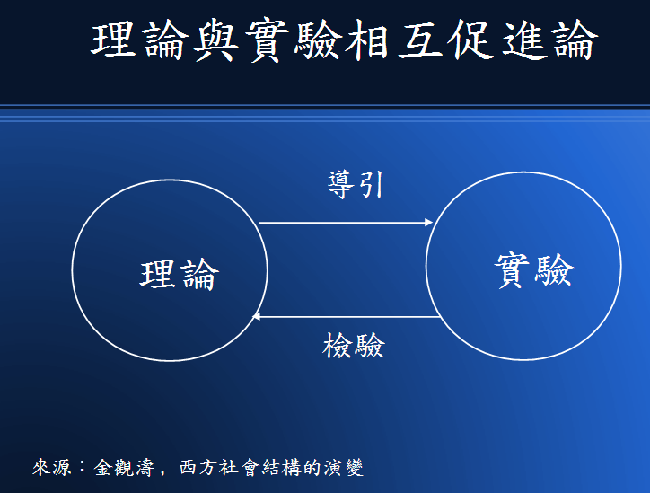
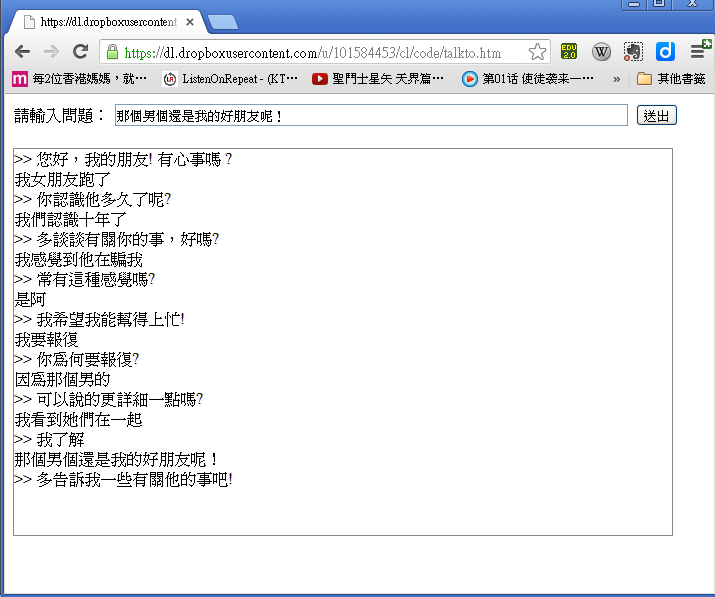

## 資訊科學到底算不算是科學呢？

### 前言

Computer Science 通常被翻成中文的「資訊科學」，不過更精準的翻譯應該是「電腦科學」或「計算機科學」。

但是、Computer Science 真的能算是一門「科學」嗎？

或許有些人會覺得納悶，這是甚麼怪問題阿！

既然是 Computer 「Science」，當然是科學啦！

但是、Computer Science 究竟有多科學呢？

另外、Computer Science 的研究有甚麼障礙等待這些「科學家」去克服呢？

這是本文想探討的問題。

### 哪些學問算是科學呢？

如果我說「物理」是一門科學，或者說「生物」是一門科學，那我想應該很少人會有意見，
因為「物理、化學、生物」這些領域可以說是典型的科學研究領域，如果這些不能被稱為科學的話，
那其他領域就完全無法被稱為「科學」了。

那麼、「心理學」、「社會學」、「經濟學」或「歷史學」，也算是科學嗎？

關於這點，我想就有很多人有意見了！

以上問題見仁見智，我們就不企圖在此進行爭論了。

接著、我們再來看看一個比較有趣的問題，那就是所有科學都需要用到的 -- 「數學」，可以算是一門科學嗎？

要談論這個問題，得讓我們先回到「工業革命」的時代！

眾所周知的是，西洋的科學文化通常會追溯到希臘三哲人的時代，然後經過了兩千年的漫長旅程，到了十五世紀
文藝復興之後，開始又復甦起來，然後更連接到「威尼斯、荷蘭、西班牙、葡萄牙」的大航海時代，接著英法等國
逐漸掌握了海權，並且在英國興起了「工業革命」之後，科學的重要性才逐漸的凸顯了出來。

所以科學和工業革命事實上是歷史上難以分開的兩個兄弟，但是、工業與科學到底有甚麼關係呢？

在我大學的時代，一直對這個問題很好奇，直到有一天，我看了金觀濤「[創造與反思]」一書中的幾篇文章之後，
概念逐漸清晰了起來，這些文章列表如下：

* 科學技術的整體觀
* 近代科學技術結構的成長
* 中國近代科學落後的原因

以下是我從這些文章中整理出來的幾個圖，讓我們用這些圖來說明「科學、實驗與工業」之間的關係。

首先讓我們聚焦在「科學與實驗之間的關係」這張圖上，我們可以看到實驗對科學的重要性，實驗可以用來
檢驗科學理論是否有誤，而科學理論則對實驗該如何進行提供了指導方向。



這種想法在 Popper (常譯為波柏或波普爾) 進化認識論當中表現得特別明顯，以下是從「[波柏的進化認識論]」
這篇文章中摘錄出來的一段話：

>  針對某一特定現象作出精確預言，並且承認：符合預言的事實不能證實自己的理論，但不符合預言的事實卻能否證這一理論，這才是真正的科學，否則即是前科學或是偽科學。

換句話說，實驗可以用來否證一個理論，但是卻不能「證明」某個理論 (只能說該理論沒有被推翻)。

於是 Popper 發展出了他著名的「進化認識論」，論述那些「可以被外在事實或實驗檢驗」的的問題，
才算是科學問題，而那些無法被「實驗檢驗」的問題，就不屬於科學性的問題。

因此、像是宗教上面論述神是否存在、或者說「只有某些特定的人才能見證到神的存在」之類的問題，都屬於
無法被「可重複的實驗結果」所檢驗的，因此無法被稱為科學問題。

如果從這個觀點來看，「物理、化學、生物」等領域，都依賴實驗來檢驗理論，因此都屬於典型的科學領域，
但是「心理、歷史、經濟與社會」等領域，由於都與人有密切的關聯，而且很難進行「可重複的實驗」，
因此就不屬於典型科學領域的範疇。

而上面所說的數學呢？由於數學並不具有「可用外在世界實驗檢驗理論」的特性，因此在 Popper 的這種想法中，
並不能算是科學性的領域。

雖然數學並不算是科學的領域，但這並不代表數學是不重要的，相反的，數學在科學上的價值是有目共睹的，
因為大部分的理論，只有在能夠表達成某種數學之後，才能夠被檢驗。舉例而言，牛頓第二運動定律 F=M*A 
這條數學式，一旦被寫出來之後，物理學家門就可以去做實驗，想辦法否證這個定律，而經過千百次的檢驗之後，
力學運動大致都符合這個定律，沒有實驗能明顯的否證此一定律時，我們才能說這是一個「定律」，否則就只能稱為
「假說」而已。

透過「實驗」來驗證理論，正是「科學」與「非科學」領域之間的最大差異。

但是、科學或不科學到底有甚麼關係呢？難道科學的興起與工業革命之間有關連嗎？且讓我們再來看看以下圖形。


在上圖中，除了原本「理論與實驗」間的良性循環之外，又加上了「科學與工業」間的循環，這個循環解釋了
為何「工業革命與科學革命」同時發生，而且兩者個關係如此緊密的原因。

「金觀濤」在上述文章中用了很清楚的邏輯，說明了「理論與實驗」、「科學與工業」間的增強循環，是如何在 15 
世紀之後發生，然後不斷增強與進步的，非常建議有興趣的讀者可以閱讀金觀濤的一系列作品。

### Computer Science 究竟有多科學呢？

再度回到我們的問題上，究竟 Computer Science 到底算不算是一門科學呢？首先讓我們看看 Computer Science 
到底在研究些甚麼？

根據筆者的研究經驗，我大致將 Computer Science 的研究分為三種類型，第一類著重於「執行速度」、第二類
著重於「使用空間」，第三類則著重於「正確率」的研究，第四類則是著重於「優化某種數字」的研究。

像是「演算法、計算機結構、網路通訊」等領域的研究，通常是為了讓「軟體、硬體、網路」更有效率，速度更快
而進行的研究，這類的研究是以「執行速度」為衡量標準的研究。

而像「資料結構、影像壓縮、檔案結構」等領域的研究，則是為了用更少的空間，達成相同或更好的效能，這類的
研究是屬於第二類的「使用空間」為衡量標準的研究。

然後、像是「影像辨識、語音辨識、手寫辨識、機器翻譯、自然語言」等領域，則是著眼於提升「翻譯或辨識」的
正確率。

最後、有些研究是在尋找某種更好的解答，像是「某個量化數字更好」等等，這類的研究通常稱為「最佳化」
或「優化」類的研究。

對於一、二類的研究而言，我們可以採用某種衡量方法，或者實際的去執行程式，以便檢驗究竟哪種方法較好。
而對於第四類的研究而言，那些數字是某個固定的函數，所以也可以很容易的計算出來，以檢驗方法的好壞。

但是對於第三類的研究而言，正確率往往會「與人有關」，這時候最後的檢驗標準必須用人來判斷，這類的研究
以「人工智慧」領域最多，其中有些問題是人類通常有共同答案的，像是「影像辨識、語音辨識、手寫辨識」等，
這些就比較容易有一致的檢證標準。

在第三類的研究當中，有些問題連人類也常有不同答案的，像是「機器翻譯」的問題，同一句英文會被翻譯
成什麼樣的中文，是每個人都有不同想法的，甚至對於同一個翻譯而言，有些人覺得這樣翻很好，也有人可
能會覺得這樣翻很糟，沒有固定的標準，這種研究在客觀上就有衡量的困難。

對於「自然語言」的研究更是如此，舉例而言，在 1950 年時資訊科學領域的開山始祖』「艾倫、圖靈」(Alan Turing)
就曾經提出一個稱為「圖靈測試」 (Turing Test) 的測驗，用來檢驗「一台電腦是否具有智慧」這件事情，
其方法很容易理解，現代的讀者可以想像當有個陌生人連進來與你做 MSN 或 facebook
訊息的交談時，您必須判斷對方到底是一個真人，或者只是一支「聊天程式」，假如有個程式厲害到
讓人判斷不出來，那麼這個程式就通過了 「圖靈測試」 。

在 Alan Turing 想出「圖靈測試」這個檢驗方法之後，很多人就開始想如何才能做出這樣一台有智慧的電腦，
一支有智慧的程式呢？這個問題在 1964 被 MIT 的 Joseph Weizenbaum 用一個非常投機取巧的方式，設計出了
一支稱為 [Eliza] 的聊天程式，不算完整的解決了「圖靈測試」這個問題。

事實上、[Eliza] 可以說是一支很擅長呼攏欺騙的程式，如果翻譯成中文來看，他其實幾乎都用那些
寒暄招呼語，以及模擬兩可的用語在與人對談，例如「你好嗎？」、「請繼續」...，另外、如果你談到「父母兄弟姊妹...」，
他就說「可以多和我聊聊有關你家人的事情嗎？」之類的泛用語， Eliza 甚至會利用樣式比對取出你的一些話後
來回答你，例如你如果說：「我心情不好！」，Eliza 就會回答說：「為何你心情不好？」，其中的
(心情不好) 這幾個字是從你的問句中用「我 * 」的方式取出來的。

以下是筆者與自己設計的「中文 Java 版 Eliza」 聊天的一個過程。

```
您好，我的朋友! 有心事嗎 ?
>> 我不開心
為何不開心?
>> 和同學吵架了
這樣喔!知道!
>> 心情很惡劣
可否多告訴ㄧ些呢?
>> 我最好的朋友罵我
你認識他多久了呢?
>> 很久了，超過十年了
...
```

如果您也想試試看與 [Eliza] 聊天的感覺，可以連線到筆者的下列網頁，試著與「中文網頁版的 Eliza」 聊聊天：

* <https://dl.dropboxusercontent.com/u/101584453/cl/code/talkto.htm>

以下是筆者與自己寫的網頁版程式聊天的一個畫面 (不過我女朋友沒有跑掉就是了 ....)。



由於這類的問題牽涉到人類的判斷，而且研究者可以利用某些人類特性去發展出一些取巧的方法，
因此往往是最難評量的一類問題。

對於第三類問題而言，假如問題的判斷最後取決於人的，那麼其檢證標準就不太容易客觀的存在，
因為與人們的判斷有關，有時候可能會見仁見智，這種類型的研究，反倒有點像是「心理學」的研究了。

### 後記

經過了 30 年的程式訓練之後，筆者深深感覺「資訊科學」其實不太像「物理、化學、生物」這樣
有一個外在的世界可以用來檢驗某個程式的。相反的，「資訊科學」反倒是比較像「數學」一樣，是從某種
「公理系統」出發，這個最初公理系統就是電腦的「機器指令」，程式設計者透過「寫程式」的方式，
告訴電腦一個「推演的方法」，然後讓那個「程式」去進行某種「自動推演」，以便找出問題的解答。

當然、由於程式的寫法無窮無盡，因此每個人寫出的程式也就大不相同，這些程式背後所根據的方法也
各有差異，因此在同一個問題上，程式的表現也就有優劣之分，但是要到底哪個程式好，哪個程式不好，
則不一定有絕對的標準，因為對於兩組不同的輸入 A , B 而言，可能「程式 1」在 A 上表現比「程式 2」好，
但是「程式 1」在 B 上表現又比又比「程式 2」糟。因此最後就得有個「綜合指標」將這些程式的表現量化，
但是這種「綜合指標」必然會導致某種的不客觀或不公平，所以在很多「資訊科學」的問題上，評量是
很難客觀的。

另外、對於那些與人有關的問題，其評量必須耗費大量的人力、時間與金錢，然而即使作完評量，這樣的
評量卻又與人有關，因此很容易產生不客觀的爭議，因此這些領域也就不容易有快速的研究進展，
像是「機器翻譯」與「自然語言」等都在評量上都存有很大的障礙。

甚至、有些障礙不只存在問題本身，而是存在「資訊科學」的研究文化上。在早期、電腦架構各不相同，
執行環境難以統一的年代，資訊科學的研究最後都是化成數學符號，然後撰寫成論文的，這個文化一直
持續到網路發達的今日，資訊科學的研究者往往在發表論文的時候並沒有附上「程式與測試資料」，這讓
想要「重複進行該研究實驗」的研究者難以檢驗論文與方法的好壞，這種文化顯然阻礙了「資訊科學」
的進步速度。

我想，資訊科學領域的研究者有必要向「開放原始碼」領域的程式設計者學習，盡可能的將「程式與測試資料」
公開，讓後續的研究者得以「精準的重複該實驗」並「檢驗論文所提出的方法」，然後從「程式原始碼當中學習該方法」，
這樣才能讓「資訊科學」成為一門「可重複的實驗結果」的領域，而這也正是 [波柏的進化認識論] 所認為
「科學應該有的必要條件」阿！

### 參考文獻
* 可重複的實驗結果是科學進步的基礎？文 / 陳紹慶（慈濟大學人類發展學系專任助理教授）
	* <http://pansci.tw/archives/43584>
* 金觀濤的理論 -- 工業革命為何沒發生在中國？
	* <https://dl.dropboxusercontent.com/u/101584453/slide/JinGuanTao2.odp>
* 維基百科：[亞里斯多德](http://zh.wikipedia.org/wiki/%E4%BA%9A%E9%87%8C%E5%A3%AB%E5%A4%9A%E5%BE%B7)
* [孔恩的科學革命] -- <http://www.nhu.edu.tw/~sts/class/class_01_2.htm>
* [波柏的進化認識論] -- <http://www.nhu.edu.tw/~sts/class/class_01_1.htm>
* [創造與反思] -- <http://www.books.com.tw/exep/prod/booksfile.php?item=0010024931>
* Wikipedia:[Turing Test] -- <http://en.wikipedia.org/wiki/Turing_test>
* 維基百科：[圖靈測試] -- <http://zh.wikipedia.org/wiki/%E5%9B%BE%E7%81%B5%E6%B5%8B%E8%AF%95>
* Wikipedia:[Eliza] -- <http://en.wikipedia.org/wiki/ELIZA>
* 陳鍾誠的網站:自然語言處理：Eliza -- <http://ccckmit.wikidot.com/nlp:eliza>
* 自己動手設計交談機器人 (Eliza 中文版) - 使用 Java -- <http://ccckmit.wikidot.com/code:eliza>

[孔恩的科學革命]:http://www.nhu.edu.tw/~sts/class/class_01_2.htm
[波柏的進化認識論]:http://www.nhu.edu.tw/~sts/class/class_01_1.htm
[創造與反思]:http://www.books.com.tw/exep/prod/booksfile.php?item=0010024931
[Turing Test]:http://en.wikipedia.org/wiki/Turing_test
[圖靈測試]:http://zh.wikipedia.org/wiki/%E5%9B%BE%E7%81%B5%E6%B5%8B%E8%AF%95
[Eliza]:http://en.wikipedia.org/wiki/ELIZA

